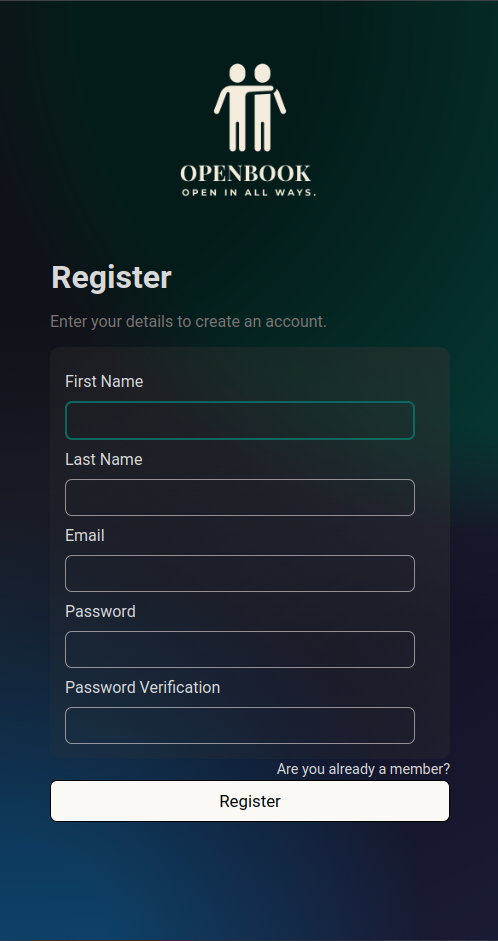
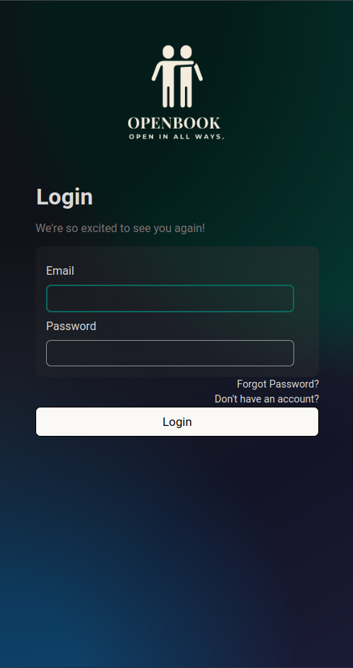
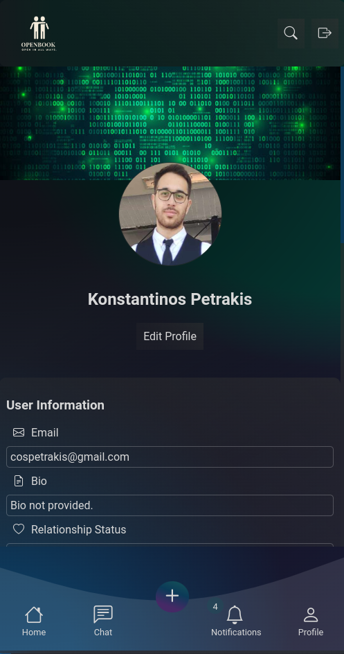
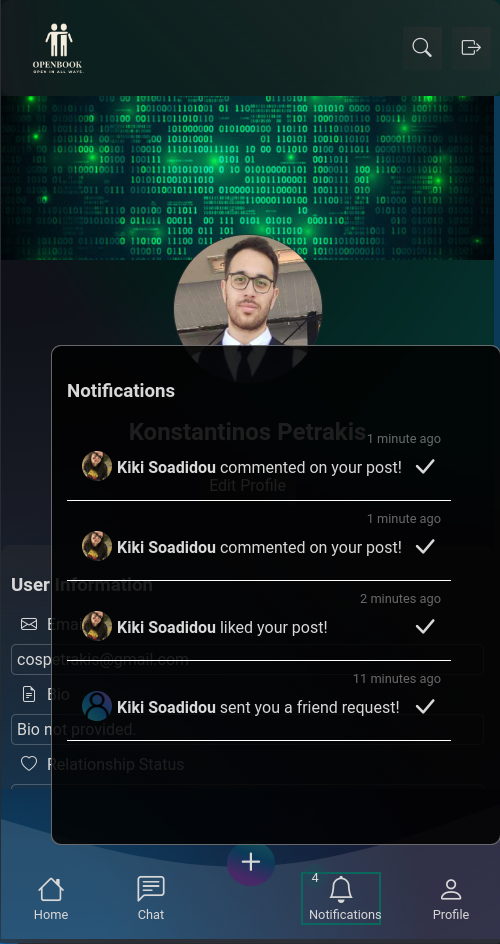
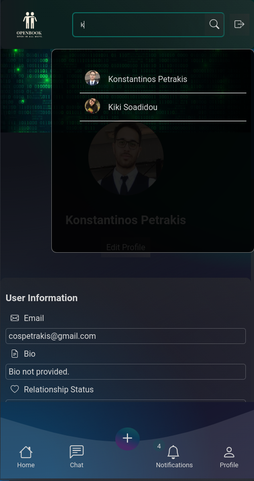
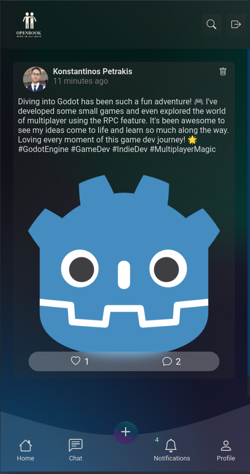
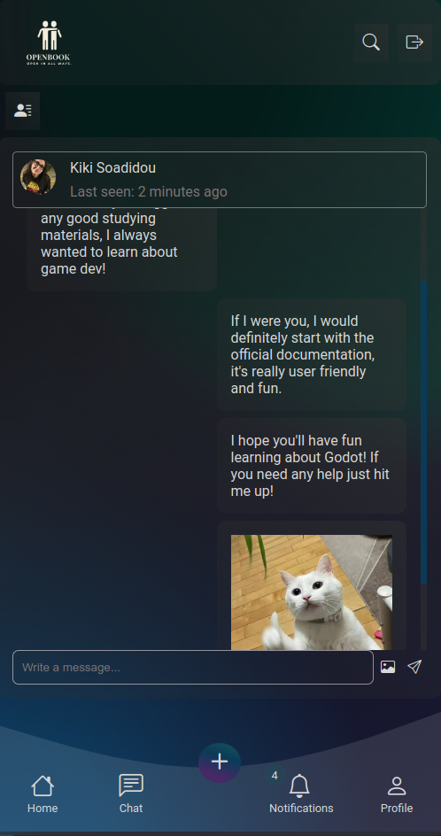

# Openbook

## Overview

An open source toy social media platform built with React and 2 identical backends, one in Django Ninja and one in Express.js.

<p>
    
    
    
    
    
    
    
</p>

## Production / Docker install

```bash
cd management
cp .env.example .env # You can change credentials and choose backend type here (python or node), default is python
# Run one of the following (configure .env fzile accordingly)
sudo docker compose -f ./docker-compose-python.yaml # For Django backend (default)
sudo docker compose -f ./docker-compose-node.yaml # For Express backend
```

## Development install

### Frontend

```bash
cp ./management/.env.example ./frontend/.env # Fill backend URLs and backend type
npm install
npm run dev
```

### Database

Setup an empty PostgreSQL database.

### Django backend

```bash
cp ./management/.env.example ./django-backend/.env # Fill database credentials and secret
cd django-backend
python -m venv venv
source ./venv/bin/activate
pip install -r requirements.txt
python manage.py migrate
python manage.py runserver
python manage.py test # Optional (in a separate terminal)
```

### Express backend

```bash
cp ./management/.env.example ./django-backend/.env # Fill database credentials and secret
cd express-backend
npm install
npx prisma generate
npx prisma migrate dev --name init
npm run dev
npm run test # Optional (in a separate terminal)
```

## TODO (might also not, this is a toy project)

-   [ ] Do not fetch public files in FileGallery immediately.
        Let them be fetched on demand (that also allows video streaming)
        This feature is required for production. See comments in `FileGallery.jsx` for implementation details.
-   [ ] Currently multiple processes run in the same container for parallelism, this is not ideal and a solution like kubernetes should be used.

## Attribution

The design of the frontend application is inspired from a [social media app template](https://dribbble.com/shots/22665347-Social-Media-App) by [Gauri Batra](https://dribbble.com/gauri05).
